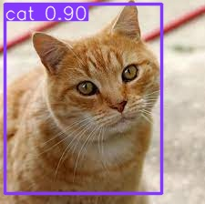
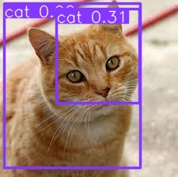

# Serverless Yolo v6 Object Detection with Daisies

## How to Call

First, we simply load the PyDaisi package:

```python
import pydaisi as pyd
import numpy as np
from PIL import Image
```

Next, we connect to the Daisi:

```python
yolo_object_detection = pyd.Daisi("erichare/YOLO Object Detection")
```

Now, let's use this image of a cat:



We simply convert it to a Numpy array and call the Daisi

```python
img = Image.open("cat.jpeg")
img.load()
img_data = np.asarray(img, dtype="int32")

yolo_result = yolo_object_detection.yolo(img_data).value
```

And finally, let's render the base64 encoded image!

```python
import base64
with open("cat-objects.jpeg", 'wb') as f:
    imgdata = base64.b64decode(yolo_result[0]["data"]["src"][23:])
    f.write(imgdata)
```



## Running the Streamlit App

Or, we can automate everything by just [Running the Streamlit App](https://dev3.daisi.io/daisies/227961c0-e3e6-4e41-927c-871a907592cb/streamlit)
