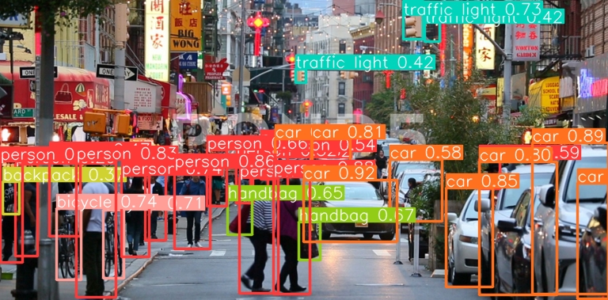

# Serverless Yolo v6 Object Detection with Daisies

## How to Call

First, we simply load the PyDaisi and supporting packages:

```python
import pydaisi as pyd
from PIL import Image
```

Next, we connect to the Daisi:

```python
yolo_object_detection = pyd.Daisi("erichare/YOLO v6 Object Detection")
```

Now, let's use this image of a busy street:


We simply load the Image and pass it to the Daisi:

```python
img = Image.open("busystreet.png")
img.load()

yolo_result, labels_df = yolo_object_detection.yolo(img, return_type=["Image", "Labels"]).value
# Or, labels_df = yolo_object_detection.yolo(img, return_type=["Labels"]).value
```

And finally, let's render the result!

```python
yolo_result.show()
```



## Running the Streamlit App

Or, we can automate everything by just [Running the Streamlit App](https://app.daisi.io/daisies/55b9ae6b-bbbf-4ff6-b3c0-cc21958f743d/streamlit)

# References

* YOLOv6 Code: [YOLOv6 Code](https://github.com/meituan/YOLOv6) from [meituan](https://github.com/meituan)
* YOLOv6 Blog: [Blog](https://dagshub.com/blog/yolov6/) from [DagsHub](https://dagshub.com)
* YOLOv6 NCNN Android app demo: [ncnn-android-yolov6](https://github.com/FeiGeChuanShu/ncnn-android-yolov6) from [FeiGeChuanShu](https://github.com/FeiGeChuanShu)
* YOLOv6 ONNXRuntime/MNN/TNN C++: [YOLOv6-ORT](https://github.com/DefTruth/lite.ai.toolkit/blob/main/lite/ort/cv/yolov6.cpp), [YOLOv6-MNN](https://github.com/DefTruth/lite.ai.toolkit/blob/main/lite/mnn/cv/mnn_yolov6.cpp) and [YOLOv6-TNN](https://github.com/DefTruth/lite.ai.toolkit/blob/main/lite/tnn/cv/tnn_yolov6.cpp) from [DefTruth](https://github.com/DefTruth)
* YOLOv6 TensorRT Python: [yolov6-tensorrt-python](https://github.com/Linaom1214/tensorrt-python/blob/main/yolov6/trt.py) from [Linaom1214](https://github.com/Linaom1214)
* YOLOv6 TensorRT Windows C++: [yolort](https://github.com/zhiqwang/yolov5-rt-stack/tree/main/deployment/tensorrt-yolov6) from [Wei Zeng](https://github.com/Wulingtian)
